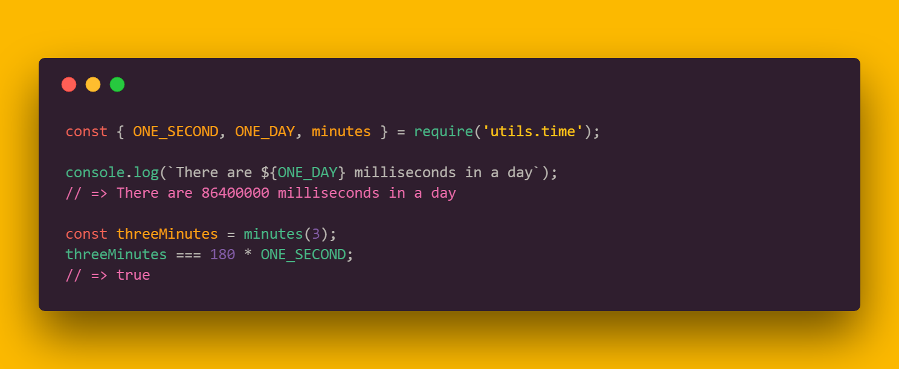

<h1 align="center">
	<br>
	
	<br>
	<br>
	<br>
</h1>

[](https://travis-ci.org/yeskunall/utils.time) [](https://github.com/prettier/prettier)

> ⌚ Micro library that makes time calculations simpler.

## Install

```
$ npm install --save utils.time
```

## Usage

ES6+ way

```js
import { seconds } from 'utils.time';

seconds(3);
//=> 3000
```

Pre-ES6 way

```js
const { seconds } = require('utils.time');

seconds(3);
//=> 3000
```
